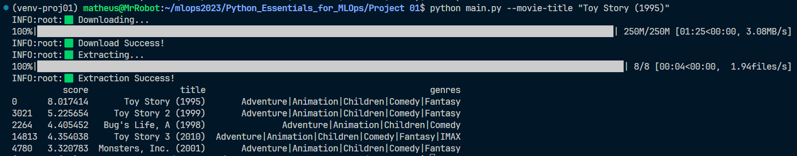
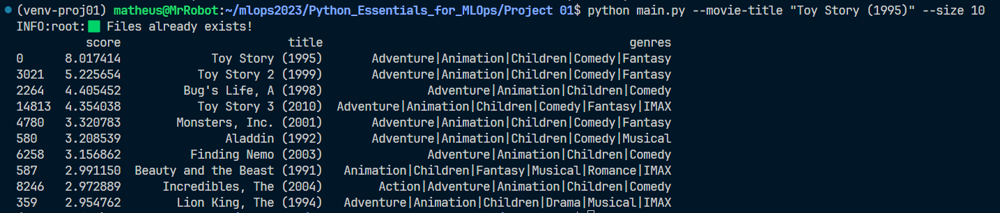
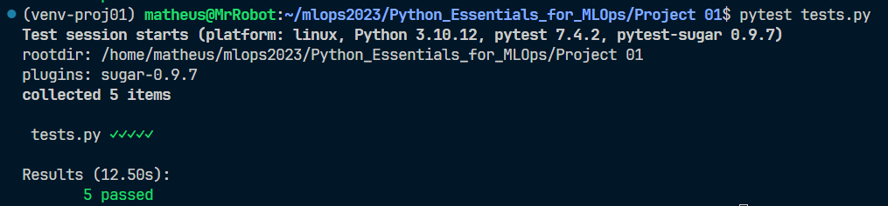
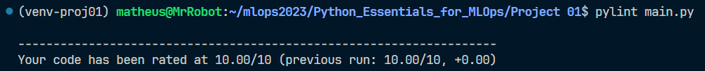
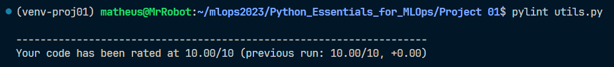

# 📝 Description

This project is a simple movie recommendation system. It uses the [MovieLens dataset](https://grouplens.org/datasets/movielens/), which contains 25 million ratings and one million tag applications applied to 62,000 movies by 162,000 users.


# 📦 Instalation

To reproduce this project, you need to clone this repository:

```bash
$ git clone https://github.com/DinizMaths/mlops2023.git
```

Now, you need to change the directory to the project folder:

```bash
$ cd mlops2023/Python_Essentials_for_MLOps/"Project 01"/
```

For a better experience, I recommend you to create a virtual environment and activate it. Finally, you need to install the requirements:

```
$ pip install -r requirements.txt
```

# 🚀 Usage

You can run the project using the following command:

```
$ python main.py --movie-title "<MOVIE_NAME>"
```
At the first time, the program will download all the data needed to run the project. After that, the program will return the top 5 movies recommended using your input as a reference. Example:

```
$ python main.py --movie-title "Toy Story (1995)"
```
The output will be:



You can also set the number of recommendations using the `--size <SIZE_NEEDED>` argument. Example:

```
$ python main.py --movie-title "Toy Story (1995)" --size 10
```



# 🧪 Code Testing

Testing a code is a good practice to ensure that the code is working as expected. In this project, I used the [pytest](https://docs.pytest.org/en/7.4.x/) library to test the code. The results of the code testing is shown below:



You can also test the code using the following command:

```
$ pytest tests.py
```

# 💯 Code Lint

A linttool is a tool that analyzes source code to flag programming errors, bugs, stylistic errors, and suspicious constructs. In this project, I used the [pylint](https://docs.pylint.org) library to lint the code. The results of the code lint is shown below:

## `main.py`



You can also lint the code using the following command:

```
$ pylint main.py
```

## `utils.py`



You can also lint the code using the following command:

```
$ pylint utils.py
```

# 📚 References

[🌐 **Build a Movie Recommendation System in Python**](https://app.dataquest.io/c/93/m/99994/build-a-movie-recommendation-system-in-python/)

[🌐 **Pytest**](https://docs.pytest.org/en/7.4.x/)

[🌐 **Pylintt**](https://docs.pylint.org)