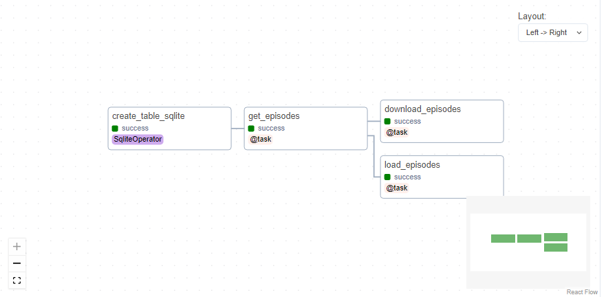

# 📝 Description

This project is a simple example of how to use Airflow to download podcasts. The podcasts are downloaded from the following link:
 https://www.marketplace.org/feed/podcast/marketplace/

# 📦 Instalation

First, clone the repository:

```bash
$ git clone https://github.com/DinizMaths/mlops2023.git
```

Then, go to the project folder:

```bash
$ cd mlops2023/Python_Essentials_for_MLOps/Project_02/
```

For a better experience, I recommend you to create a virtual environment and activate it. Finally, you need to install the requirements:

```
$ pip install -r requirements.txt
```

Now, you will need to install Airflow. Use the following commands:

```bash
export AIRFLOW_HOME=$(pwd)/airflow

export AIRFLOW_VERSION=2.7.1
export PYTHON_VERSION="$(python --version | cut -d " " -f 2 | cut -d "." -f 1-2)"
export CONSTRAINT_URL="https://raw.githubusercontent.com/apache/airflow/constraints-${AIRFLOW_VERSION}/constraints-${PYTHON_VERSION}.txt"

pip install "apache-airflow==${AIRFLOW_VERSION}" --constraint "${CONSTRAINT_URL}"
```

# 🚀 Usage

After installing Airflow, you need to initialize the database:

```bash
airflow db init
```

Now, you can run the standalone mode:
    
```bash
airflow standalone
```

(Optional) If you don't want to load the examples, you can change the configuration file. In `./airflow/airflow.cfg`, change the value of `load_examples` to `False`. This will prevent the examples from being loaded.

Now in **other terminal**, you can run the following command to create the necessary folders:

```bash
mkdir ./airflow/dags
mkdir ./airflow/episodes
```

For this project, we will use a SQLite database. To create the database, run the following commands:

```bash
wget https://www.sqlite.org/2023/sqlite-tools-linux-x86-3430100.zip
unzip sqlite-tools-linux-x86-3430100.zip
rm sqlite-tools-linux-x86-3430100.zip
mv ./sqlite-tools-linux-x86-3430100/sqlite3 ./airflow/sqlite3
rm -rf ./sqlite-tools-linux-x86-3430100
```

This will download the SQLite tools and move the `sqlite3` executable to the `airflow` folder. Now, you can create the database:

```bash	
cd airflow
sqlite3 episodes.db
.databases
.quit
cd ../
```

At this point, you can run the following command to create the `podcasts` connection:

```bash
export CONN_HOST=${AIRFLOW_HOME}/episodes.db
airflow connections add 'podcasts' --conn-type 'sqlite' --conn-host "${CONN_HOST}"
airflow connections get 'podcasts'
```

At last, you can open the [Airflow](http://localhost:8080/home) UI in your browser. It will needs a username and password. The default username is `admin` and the password is located in `./airflow/standalone_admin_password.txt`.

After running the DAG called `podcast_summary`, if your result is similar to the following image:



Your podcast was downloaded successfully! 🎉

And you can find the downloaded podcast in `./airflow/episodes/`.

# References

[🌐 **Build an Airflow Data Pipeline to Download Podcasts**](https://app.dataquest.io/c/93/m/999911/build-an-airflow-data-pipeline-to-download-podcasts/)