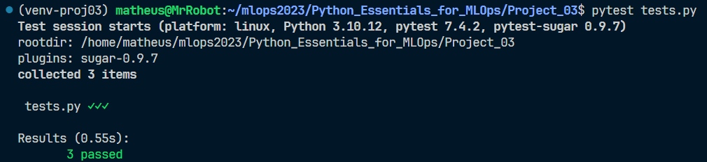
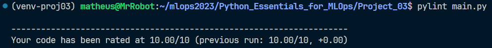
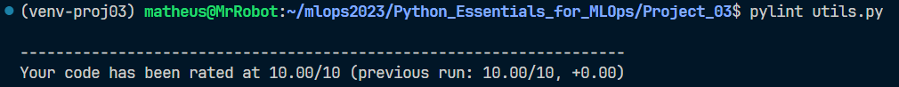

# 📝 Description

This project is a system to analyze the parameters impact on the model performance. In other words, this system will optimize the model prediction.

Optimization is a very important step in the machine learning pipeline. It is the process of finding the best set of hyperparameters for a model. Hyperparameters are the parameters that are not learned by the model. They are set by the data scientist before training the model.

The data used in this project is the [Forest Fires](https://archive.ics.uci.edu/dataset/162/forest+fires)

# 📦 Instalation

To reproduce this project, you need to clone this repository:

```bash
$ git clone https://github.com/DinizMaths/mlops2023.git
```

Now, you need to change the directory to the project folder:

```bash
$ cd mlops2023/Python_Essentials_for_MLOps/Project_03/
```

For a better experience, I recommend you to create a virtual environment and activate it. Finally, you need to install the requirements:

```
$ pip install -r requirements.txt
```

# 🚀 Usage

You can run the project using the following command:

```
$ python main.py
```
At the first time, the program will download all the data needed to run the project.

# 🧪 Code Testing

Testing a code is a good practice to ensure that the code is working as expected. In this project, I used the [pytest](https://docs.pytest.org/en/7.4.x/) library to test the code. The results of the code testing is shown below:



You can also test the code using the following command:

```
$ pytest tests.py
```

# 💯 Code Lint

A linttool is a tool that analyzes source code to flag programming errors, bugs, stylistic errors, and suspicious constructs. In this project, I used the [pylint](https://docs.pylint.org) library to lint the code. The results of the code lint is shown below:

## `main.py`



You can also lint the code using the following command:

```
$ pylint main.py
```

## `utils.py`



You can also lint the code using the following command:

```
$ pylint utils.py
```

# 📚 References

[🌐 **Build a Movie Recommendation System in Python**](https://app.dataquest.io/c/139/m/764/guided-project%3A-optimizing-model-prediction/)

[🌐 **Pytest**](https://docs.pytest.org/en/7.4.x/)

[🌐 **Pylintt**](https://docs.pylint.org)